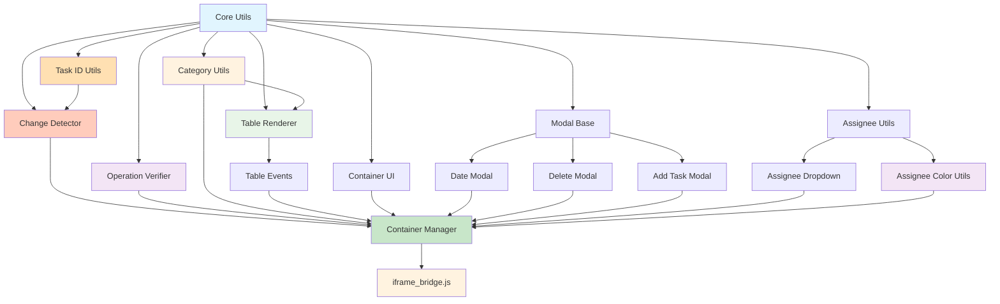

# Fancy Google Space Tasks

Enhanced Google Space Tasks with better UI and features using completely restructured modular architecture.

## 🌟 Features

- **Multi-Column Category Support**: Parse `[category1][category2]Task Title` format and display in separate columns
- **Advanced Task Grouping**: Automatic grouping and sorting by category combinations with rowspan support
- **Completed Tasks Toggle**: Show/hide completed tasks with dedicated toggle button (default: hidden)
- **OKLCH Color Support**: Modern color space with graceful HSL fallback for category styling
- **Unique Color Generation**: Each category combination gets distinct colors using hash-based generation
- **Enhanced DOM Monitoring**: Smart change detection system for real-time updates and background sync
- **Operation Verification**: UI locking and polling-based verification for safe task operations
- **Timer Management**: Centralized timeout/interval management with automatic cleanup
- **Modal Editing**: Click one of date of assignee button to edit a task(TODO)
- **Modal Interfaces**: Editing title with dynamically generated category dropdown boxes, editing description, date picker, assignee selector, and delete confirmation with dedicated modules(TODO)
- **UI Toggle**: Floating button to switch between enhanced and original Google Tasks UI
- **Background Updates**: Automatic detection of changes made in original mode or from other devices
- **Date Visualization**: Visualize time schedule using extracted date information(TODO)

## 🗂️ Architecture

### Modular Design

```
📁 Project Structure
├── manifest.json                  # Extension manifest
├── 📁 bundles/
│   ├── linkify.js                 # Bundled [nfrasser/linkifyjs v4.3.2] package to attach links to texts
│   ├── linkify-string.js          # String module of linkifyjs
│   └── color-thief.min.js         # Color extractor from image [lokesh/color-thief v2.6.0]
└── 📁 src/
    ├── iframe_bridge.js           # Main page iframe detection & injection
    │
    ├── 📁 core/                   # Core utilities (shared by all modules)
    │   ├── dom_utils.js           # DOM manipulation utilities with lock styles management
    │   ├── interaction_utils.js   # Original DOM interaction utilities with verification
    │   ├── notification_utils.js  # Notification system
    │   ├── event_utils.js         # Event handling utilities with TimeoutManager & IntervalManager
    │   ├── task_id_utils.js       # TaskId extraction utilities for change detection
    │   ├── change_detector.js     # Task change detection system
    │   └── operation_verifier.js  # Operation verification with UI locking system
    │
    ├── 📁 table/                  # Table rendering and events (fancy-gst-tasks-table)
    │   ├── table_renderer.js      # Table generation, grouping & rowspan rendering with OKLCH/HSL color support
    │   ├── table_events.js        # Table-specific event handling
    │   └── table.css              # Table-specific styles with grouping support
    │
    ├── 📁 container/              # Container management (outside table)
    │   ├── container_manager.js   # Main container orchestration with enhanced change detection and completed tasks toggle
    │   ├── container_ui.js        # Container UI creation & management with dual toggle buttons
    │   └── container.css          # Container-specific styles with toggle buttons
    │
    ├── 📁 category/               # Category parsing and utilities
    │   ├── category_parser.js     # Category parsing from task titles
    │   └── category_utils.js      # Category seed generation and utilities (color logic moved to TableRenderer)
    │
    ├── 📁 modal/                  # Modal system (specialized by type)
    │   ├── modal_base.js          # Base modal class with common functionality
    │   ├── date_modal.js          # Date picker modal
    │   ├── delete_modal.js        # Delete confirmation modal
    │   ├── add_task_modal.js      # Add new task modal
    │   └── modal.css              # Modal-specific styles
    │
    └── 📁 assignee/               # Assignee management
        ├── assignee_dropdown.js   # Assignee selection modal
        ├── assignee_utils.js      # Assignee utilities & formatting
        └── assignee_color_utils.js # Color extraction from assignee avatars
```

### Module Dependencies



### Loading Sequence

The `iframe_bridge.js` loads modules in strict dependency order:

1. **Core Layer**: `dom_utils.js` → `notification_utils.js` → `event_utils.js` → `interaction_utils.js` → `task_id_utils.js` → `change_detector.js` → `operation_verifier.js`
2. **Foundation Layer**: `category_parser.js` → `category_utils.js`
3. **Modal Layer**: `modal_base.js` → `date_modal.js` → `delete_modal.js` → `add_task_modal.js`
4. **Feature Layer**: `assignee_utils.js` → `assignee_color_utils.js` → `assignee_dropdown.js`
5. **UI Layer**: `table_renderer.js` → `table_events.js`
6. **Application Layer**: `container_ui.js` → `container_manager.js`

## 🎨 Styling Architecture

### CSS Organization
- **`src/table/table.css`**: Styles for `fancy-gst-tasks-table` block, rowspan grouping, and table-specific elements
- **`src/container/container.css`**: Styles for container, header, footer, layout outside the table, and toggle buttons
- **`src/modal/modal.css`**: Comprehensive modal styles for all modal types
- **Category styling**: Generated dynamically via JavaScript with hash-based unique color system supporting OKLCH (with HSL fallback)
- **Lock styling**: Dynamically injected by `dom_utils.js` for UI locking during operations

### Dark Mode Support
All CSS files include comprehensive dark mode support using `@media (prefers-color-scheme: dark)`.

### Color System
- **OKLCH Priority**: Uses modern OKLCH color space when supported for better perceptual uniformity
- **HSL Fallback**: Gracefully falls back to HSL on browsers without OKLCH support
- **Cumulative Category Seeds**: Generates seeds using cumulative category format `[cat1][cat2][cat3]` for consistent color mapping

## 🧩 Module Responsibilities

### Core Modules
- **DOM Utils**: HTML escaping, element creation, CSS loading, waiting for elements, **lock styles management**
- **Interaction Utils**: Original Google Tasks DOM manipulation and triggering **with operation verification**
- **Notification Utils**: Toast notifications with different types and animations
- **Event Utils**: Event binding, delegation, debouncing, **TimeoutManager & IntervalManager for centralized timer control**
- **Task ID Utils**: Lightweight TaskId extraction utilities for efficient change detection
- **Change Detector**: Task change detection system for monitoring DOM updates and background sync
- **Operation Verifier**: UI locking, operation completion verification with polling, cleanup management

### Table Modules
- **Table Renderer**: Table HTML generation with grouping, sorting, rowspan support, and unified OKLCH/HSL color generation from category seeds
- **Table Events**: Event handling specific to table interactions (editing, checkboxes, actions)

### Container Modules
- **Container Manager**: Main orchestration, task extraction, change detection, modal coordination, background DOM monitoring, completed tasks filter management, **operation verification integration**
- **Container UI**: Footer, statistics, loading states, toggle functionality, and dual toggle button management (UI mode + completed tasks)

### Category Modules
- **Category Parser**: Extract categories from `[cat1][cat2]Title` format, validation
- **Category Utils**: Category seed generation and parsing utilities - provides cumulative category seeds for color generation

### Modal Modules
- **Modal Base** (TODO): Common modal functionality, focus management, accessibility
- **Date Modal** (TODO): Date picker with quick options and time selection
- **Delete Modal** (TODO): Confirmation dialog with safety checkbox
- **Add Task Modal** (TODO): Task creation with category management and preview

### Assignee Modules
- **Assignee Utils** (TODO): Name formatting, avatar generation, statistics, validation
- **Assignee Color Utils**: Color extraction from assignee avatar images using ColorThief library
- **Assignee Dropdown** (TODO): Team member selection with search and management

## 🎮 User Interface

### Enhanced Features
- **Category Grouping**: Dynamic table grouping with rowspan cells for same category combinations
- **Completed Tasks Filter**: Toggle visibility of completed tasks with dedicated button (hidden by default)
- **Cumulative Color System**: Seed-based OKLCH/HSL color generation with cumulative category logic for visual consistency
- **Smart Sorting**: Automatic sorting by category depth, and original task sequence
- **Enhanced Change Detection**: Real-time monitoring of DOM changes in both modes
- **Background Sync Detection**: Automatic updates when changes occur from other devices or apps
- **Operation Verification**: UI locking and polling-based verification for safe operations (prevents double-submission)
- **Timer Management**: Automatic cleanup of all timeouts/intervals preventing memory leaks
- **Modal System** (TODO): Specialized modals for different actions
- **Team Management** (TODO): Assignee selection with avatar generation and color extraction

### Toggle System
- **Enhanced UI**: Custom modular interface with full feature set including advanced grouping and unified OKLCH/HSL color support
- **Original UI**: Standard Google Tasks interface
- **Main Toggle Button**: Seamless switching between modes with automatic change detection
- **Completed Tasks Toggle**: Show/hide completed tasks independently (default: hidden)
- **State Persistence** (NEED-VERIFY): Remembers preferred mode

### Change Detection Features
- **Mode Switch Detection**: Automatically detects and applies changes when switching from original to fancy mode
- **Background Monitoring**: Continues monitoring DOM changes even in original mode
- **Window Focus Detection**: Checks for changes when returning from other applications
- **Smart Updates**: Only updates when actual changes are detected, preserving performance
- **Filter Awareness**: Properly handles table re-rendering when toggling completed tasks visibility

### Operation Verification Features
- **UI Locking**: Prevents user interaction during operations (gray-out & disable)
- **Polling Verification**: Checks operation completion by monitoring DOM changes
- **Automatic Cleanup**: Clears all timers and unlocks UI on completion/timeout
- **Error Handling**: Graceful failure handling with user notifications
- **Double-Click Prevention**: Prevents repeated operations while one is in progress

### Refactoring Information

Cooperated with AI